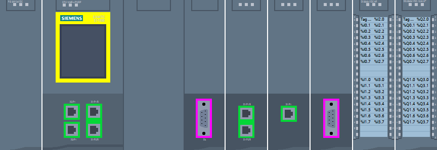
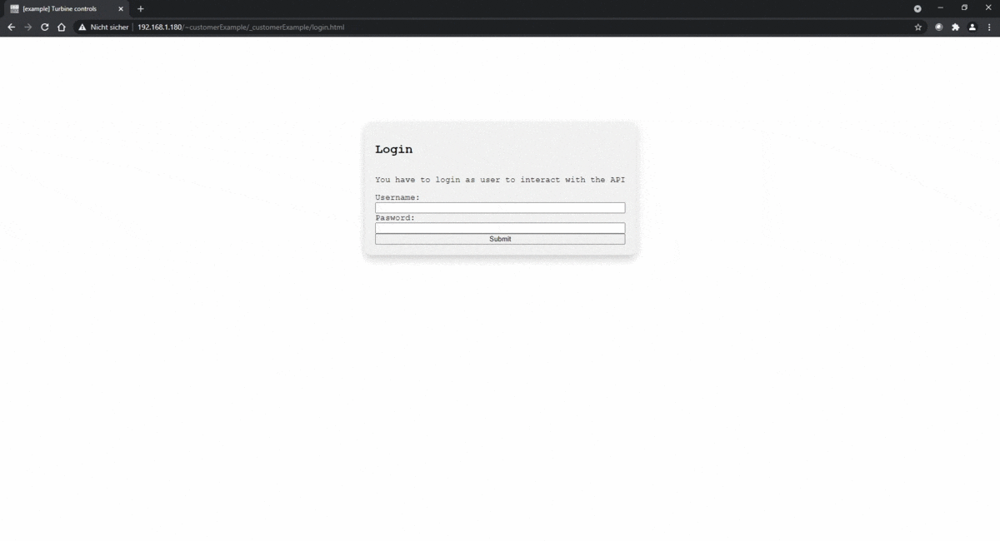

# WebserverApi Client Library for .NET
This package targeting .NET Framework 4.8 or greater and .NET Standard 2.0 and above provides the user with Method calls to the PLC Webserver Api using the HttpClient to make the usage of Api functionalities easier.

* Package name: **Siemens.Simatic.S7.Webserver.API**

# Table of contents
- [WebserverApi Client Library for .NET](#webserverapi-client-library-for-net)
- [Table of contents](#table-of-contents)
- [License](#license)
- [Dependencies](#dependencies)
- [Usage](#usage)
- [ApiHttpClientRequestHandler](#apihttpclientrequesthandler)
- [WebApps](#webapps)
  - [AsyncWebAppDeployer, WebAppConfigParser](#asyncwebappdeployer-webappconfigparser)
- [PlcProgram Browse Read and Write](#plcprogram-browse-read-and-write)
- [Compatibility](#compatibility)
  - [SIMATIC S71500:](#simatic-s71500)
  - [SIMATIC S71200:](#simatic-s71200)
- [Limitations](#limitations)
- [OPC UA or Web API?](#opc-ua-or-web-api)
- [Further Information about PLC (Webserver)](#further-information-about-plc-webserver)
  - [SIMATIC S71500:](#simatic-s71500-1)
  - [SIMATIC S71200:](#simatic-s71200-1)

# [License](LICENSE.md)

# Dependencies
* [System.Net.Http](https://www.nuget.org/packages/system.net.http/)
* [Newtonsoft.Json](https://www.nuget.org/packages/Newtonsoft.Json/)
* [MimeMapping](https://www.nuget.org/packages/MimeMapping/)

# Usage
The Functionalities come together in the ApiHttpClientRequestHandler that implements the IAsyncApiRequesthandler (and also in any implementation of the IApiRequestHandler - not given by example). 

In the following example code you'll have to adjust the IpAddress ("192.168.1.1") and the login for your system - the Login "Everybody" with the password "" is a default user that is downloaded to the plc for the webserver once the webserver is activated in TIA portal. The used functions would fail for the default case that he doesn't have the permissions call the method (that he tried to call). It is not good practice to give a lot of rights to the user "Everybody" therefore please adjust the connectionconfiguration to your configured user with a safe password that should be able to call the methods.

Further examples of usage are also provided in the UnitTests of the component.

# ApiHttpClientRequestHandler
To use e.g. the Api Method "Api.Browse" to get all the Methods supported by the PLC Api do the following
```cs
var serviceFactory = new ApiStandardServiceFactory();
var reqHandler = await serviceFactory.GetApiHttpClientRequestHandlerAsync("192.168.1.1", "Everybody", "");
var apiBrowseResponse = await reqHandler.ApiBrowseAsync();
foreach(var method in apiBrowseResponse.Result)
{
    Console.WriteLine(method.Name);
}
```
**Hint**: The PLC Certificate is by default not accepted by your PC - therefor you have to either download and store the certificate in the trusted root ca certificates or implement the validation callback for your system - a "plain" check for => true is not good practice but it will get you started in case you dont want to download and install the certificate.
```cs
...
using System.Net;
...
// For .net48
ServicePointManager.ServerCertificateValidationCallback += (sender, certificate, chain, sslPolicyErrors) => true;
// For .net6.0 and greater
Siemens.Simatic.S7.Webserver.API.Services.ServerCertificateCallback.CertificateCallback = (sender, cert, chain, sslPolicyErrors) => true;
```
Of course you can also implement a check for the sender and so on.
# WebApps

For the PLC WebApps Further Comfort can be accomplished by using the ApiWebAppData and ApiWebAppResource implementations:
Generally you are free to configure everything on your own:
```cs
public static DirectoryInfo CurrentExeDir
{
    get
    {
        string dllPath = System.Reflection.Assembly.GetExecutingAssembly().Location;
        return (new FileInfo(dllPath)).Directory;
    }
}
...
var app = new ApiWebAppData() { Name = "customerExample", State = ApiWebAppState.Enabled };
await requestHandler.WebAppCreateAsync(app);
app = (await requestHandler.WebAppBrowseAsync(app)).Result.Applications.First();
var ticketForCreation = await requestHandler.WebAppCreateResourceAsync(app, "index.html", "text/html", "2020-07-29T14:52:22Z");
await requestHandler.UploadTicketAsync(ticketForCreation.Result, Path.Combine(CurrentExeDir.FullName, "_WebApps", "customerExample", "index.html"));
// (optional) check for the Ticket state
var ticket = (await requestHandler.ApiBrowseTicketsAsync(ticketForCreation.Result)).Result.Tickets.First();
// close the ticket again!
await requestHandler.ApiCloseTicketAsync(ticket.Id);
if (ticket.State != ApiTicketState.Completed)
{
    throw new ApiTicketNotInCompletedStateException(ticket);
}
await requestHandler.WebAppSetDefaultPageAsync(app, "index.html");
// do this in a loop for all resources and perform management yourself OR            
```
but further comfort can be accomplished with:
## AsyncWebAppDeployer, WebAppConfigParser
You can use Implementations to comfortably deploy the apps to the plc with a Deployer and FileParser for your WebAppDirectory:
```cs
var parser = new WebAppConfigParser(Path.Combine(CurrentExeDir.FullName, "_WebApps", "customerExample"), "WebAppConfig.json");
app = parser.Parse();
var deployer = serviceFactory.GetApiWebAppDeployer(reqHandler);
await deployer.DeployOrUpdateAsync(app);
var apiWebAppBroseResourcesResponse = await requestHandler.WebAppBrowseResourcesAsync("customerExample");
foreach(var resource in apiWebAppBroseResourcesResponse.Result.Resources)
{
    Console.WriteLine(JsonConvert.SerializeObject(resource, new JsonSerializerSettings() { ContractResolver = new CamelCasePropertyNamesContractResolver(), NullValueHandling = NullValueHandling.Ignore }));
}
```
The Parser and Deployer also use a set of comfort functions - in case you want to know or take a look they are using:
```cs
namespace Siemens.Simatic.S7.Webserver.API.Services.WebApp {
public class ApiResourceHandler {}
public class ApiWebAppResourceBuilder {}
}
```
**Hint**: It is possible to add another parameter to the new WebAppConfigParser(*,*,bool ignoreBOMDifference = false):
This is the case because uploading files using javascript on a webpage has shown that the BOM (Byte Order Mark) is not transmitted!
Therefor if you upload a file using javascript and then make the deployer do the comparison between the file locally (windows explorer) and the one on the server(plc) the files would be different since the size is different by three bytes. To get rid of this "false positive" on a difference you can set the ignoreBOMDifference to true - but keep in mind that a change of 3 bytes would then also be accepted as no difference. The deployer would still reupload the file since the last_modified dates would not match!

# PlcProgram Browse Read and Write
The PlcProgram Methods can be used to Browse available variables and to read or write their value.
```cs
...
using Siemens.Simatic.S7.Webserver.API.Models;
using Siemens.Simatic.S7.Webserver.API.RequestHandler;
using Siemens.Simatic.S7.Webserver.API.Responses;
using Siemens.Simatic.S7.Webserver.API.Models.ApiPlcProgramDataTypes;
...
// PlcProgramRead example: object will work for any plcdatatype that is implemented by the api, you could also provide "bool" here
var boolReadResult = await requestHandler.PlcProgramReadAsync<object>("\"DataTypes\".\"Bool\"");
Console.WriteLine(boolReadResult.Result);
// Tia Data Type "Date_And_Time" and "S5Time" are returned as objects - therefore an Implementation is done as the "ApiDateAndTime" and "ApiS5Time"
ApiResultResponse<ApiDateAndTime> dateAndTimeReadResult = 
    await requestHandler.PlcProgramReadAsync<ApiDateAndTime>("\"DataTypes\".\"TIA_Dates\".\"Date_And_Time\"");
DateTime myDt = dateAndTimeReadResult.Result.GetDateTime();
myDt = (new DateTime(2021, 04, 26, 16, 53, 22).AddMilliseconds(13));
await requestHandler.PlcProgramWriteAsync("\"DataTypes\".\"TIA_Dates\".\"Date_And_Time\"", new ApiDateAndTime(myDt));
dateAndTimeReadResult = 
    await requestHandler.PlcProgramReadAsync<ApiDateAndTime>("\"DataTypes\".\"TIA_Dates\".\"Date_And_Time\"");
Console.WriteLine(dateAndTimeReadResult.Result.GetDateTime().ToString("dd/MM/yyyy hh:mm:ss.fff tt"));
ApiResultResponse<ApiS5Time> s5TimeReadResult = 
    await requestHandler.PlcProgramReadAsync<ApiS5Time>("\"DataTypes\".\"TIA_Dates\".\"S5Time\"");
Console.WriteLine(s5TimeReadResult.Result.GetTimeSpan());
// TIA Data types like "Date", "Time", "LTime", "Time_Of_Day", "LTime_Of_Day" are returned as int/uint values when using
// the "simple" mode for PlcProgram.Read => it makes sense to know how to get those into a DateTime/TimeSpan:
// Example for "Date" (you'll have to adjust this for "Time","LTime",...)
var dateReadResult = await requestHandler.PlcProgramReadAsync<uint>("\"DataTypes\".\"TIA_Dates\".\"Date\"");
DateTime date = new DateTime(1990, 1, 1) + TimeSpan.FromDays(dateReadResult.Result);
date = new DateTime(2021, 04, 26);
// for writing: determine the amount of days that is between 1/1/1990 and the time you want to write => write the value as a uint
// or int or long, ... a number that is no double/float => (2 not 2.0) - thats what the plc expects
TimeSpan ts = date - new DateTime(1990, 1, 1);
await requestHandler.PlcProgramWriteAsync("\"DataTypes\".\"TIA_Dates\".\"Date\"", (uint)ts.TotalDays);
```
Also for these PlcProgram methods there is an Implementation for an ApiPlcProgramData object that can be used for the Api methods:
```cs
...
using System.Collections.Generic;
...
// Do not provide any variable when browsing to browse the "root" "directory" of the plc program data:
List<ApiPlcProgramData> allMyPlcProgramBlocks = (await requestHandler.PlcProgramBrowseAsync(ApiPlcProgramBrowseMode.Children)).Result;
// A DB called "DataTypes" has the variables we care about:
var myPlcProgramDataBlock = allMyPlcProgramBlocks.First(el => el.Name == "DataTypes");
var myPlcProgramDataBlockChildren = (await requestHandler.PlcProgramBrowseAsync(ApiPlcProgramBrowseMode.Children, myPlcProgramDataBlock)).Result;
myPlcProgramDataBlock.Children = myPlcProgramDataBlockChildren;
// It is important to set the Parent list correctly so the variable name will be provided correctly to read/write the value of the variable
foreach(var child in myPlcProgramDataBlock.Children)
{
    child.Parents = new List<ApiPlcProgramData>() { myPlcProgramDataBlock };
}
// now we want to read the value of a variable called "Bool":
var myBool = myPlcProgramDataBlock.Children.First(el => el.Name == "Bool");
myBool.Value = (await requestHandler.PlcProgramReadAsync<bool>(myBool)).Result;
Console.WriteLine(myBool.Value);
// write the "Bool" variable
await requestHandler.PlcProgramWriteAsync(myBool, true);
// and read the value again:
myBool.Value = (await requestHandler.PlcProgramReadAsync<bool>(myBool)).Result;
Console.WriteLine(myBool.Value);
```

# Compatibility

Use the following table to find the correct client version for each Plc version (server)

## SIMATIC S71500:
Plc Version | Client Library Version
------------------|---------------
2.9.x              | 1.0.x
2.9.x              | 2.0.x

## SIMATIC S71200:
Plc Version | Client Library Version
------------------|---------------
4.5.x             | 1.0.x
4.5.x             | 2.0.x

**Hint**: The current (first) Wrapper Version supports more API calls than the current S71200 does - the S71200 will likely(!) support the API calls of the wrapper with the next version.


# Limitations

Currently some Features are not implemented yet. Check out the [Issues](https://github.com/siemens/simatic-s7-webserver-api/issues) to get further information about open issues.

# OPC UA or Web API?

To be honest, I'm not sure that a hard comparison between OPC UA and the Web API is that useful. 

Both flavors of open interoperability to other systems are fully supported and continuously developed by Siemens. Some features are supported by either one or the other, and for the features that are supported by both, it's ultimately up to your preferences. 

**OPC UA** is a widely known and supported **industry standard** developed and maintained by the **OPC Foundation** that was created for a variety of **Plug&Play** communication use cases. Quite in the sense of a strategic orientation of a cross vendor **interoperability**. The focus here is set on data exchange in the most interoperable and efficient way (subscriptions, companion specifications, …). This also includes **plc-to-plc-communication** via OPC Client and Server. 

The focus of the **Web API** rather is **maintenance**, **problem finding** and offering the possibility to implement small and medium-sized **Web Applications**. This API is based on standardized **JSON-RPC** via **HTTPS** communication with a Simatic-specific data model.  

Unfortunately a general performance expectation is hard to calculate as this is highly dependent on use cases, requirements, the given environment and the used system.

For feature-specific details and evaluation of what best suits your use case, please also take a look into the manuals of OPC UA or the Webserver.

# Further Information about PLC (Webserver)

See Also:

## SIMATIC S71500:
- SIMATIC S71500: https://new.siemens.com/global/en/products/automation/systems/industrial/plc/simatic-s7-1500.html
- SIMATIC S71500 Webserver Manual: https://support.industry.siemens.com/cs/us/en/view/59193560
- SIMATIC S71500 Manual Collection: https://support.industry.siemens.com/cs/us/en/view/86140384


## SIMATIC S71200:
- SIMATIC S71200: https://new.siemens.com/global/en/products/automation/systems/industrial/plc/s7-1200.html
- SIMATIC S71200 Manual: https://support.industry.siemens.com/cs/ch/en/view/109797241
- SIMATIC S71200 Manual: https://support.industry.siemens.com/cs/us/en/view/91696622/45063671307
